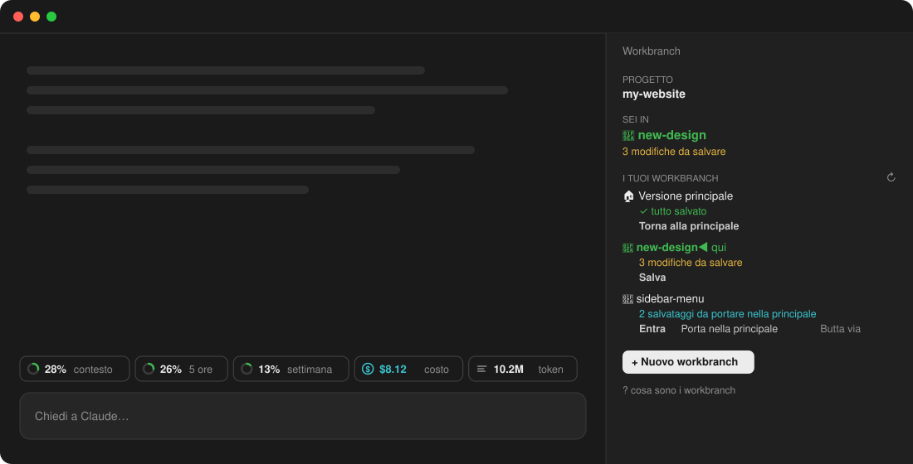
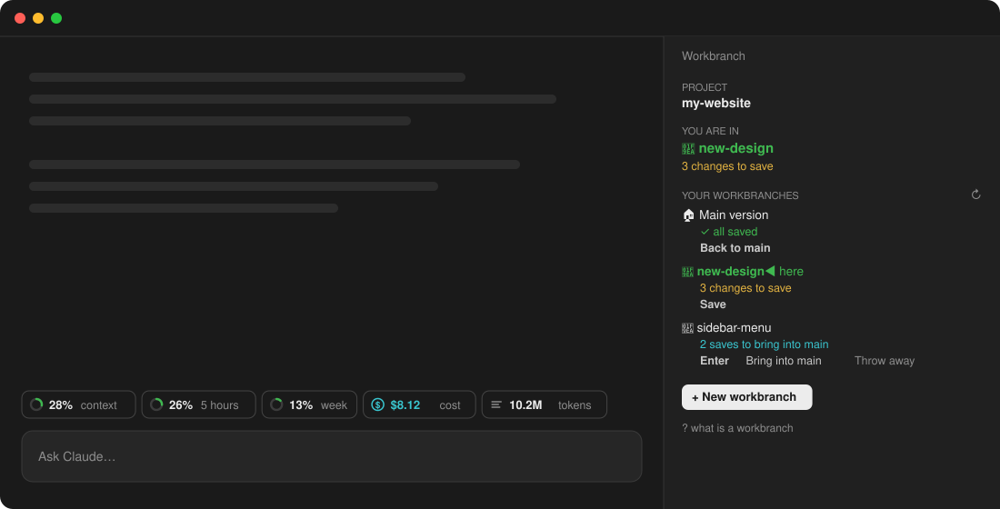

# Supermod ClaudeCode

**🇮🇹 [Italiano](#italiano) · 🇬🇧 [English](#english)**

A mod for [Claude Code](https://claude.com/claude-code): a usage bar above the prompt, and **workbranches**, trial copies of your project that make git worktrees simple for people who have never used git.

---

## Italiano



### Cos'è un workbranch

Un **workbranch** è una **copia di prova del tuo progetto**. Ci lavori, tu o Claude, senza toccare la **versione principale**:

- se la prova va bene, la **porti nella principale** con un clic;
- se va male, la **butti via** e la principale resta com'era.

### Perché è molto più comodo

Senza workbranch, provare un'idea con Claude significa lavorare direttamente sul progetto vero: se il risultato non ti piace, devi annullare tutto a mano. Con git le cose migliorano, ma bisogna conoscere branch, worktree, commit e merge, e capire in quale cartella si sta lavorando.

Con i workbranch:

| Prima | Con i workbranch |
|---|---|
| Claude modifica direttamente il progetto vero | Claude lavora su una copia: la versione principale è al sicuro |
| Per provare due idee devi farle una dopo l'altra | Ogni idea ha il suo workbranch, anche in parallelo |
| Ti perdi tra cartelle, branch e worktree | Il pannello ti dice sempre **dove sei** e cosa c'è da fare |
| Worktree e branch sono due cose separate da gestire | Un workbranch è una cosa sola: nasce, si salva, si porta nella principale o si butta |
| Comandi git da ricordare | Pulsanti: **Salva**, **Porta nella principale**, **Butta via** |
| Un conflitto di merge è un muro | **Chiedi a Claude di sistemarlo**: un clic e Claude risolve |
| Puoi perdere lavoro rimuovendo la cartella sbagliata | Ti avvisa prima se perderesti modifiche o salvataggi |

### Il pannello Workbranch

- **Sei in**: il workbranch in cui sta lavorando Claude, e cosa c'è da fare ("3 modifiche da salvare");
- 🏠 **Versione principale** e 🧪 i tuoi **workbranch**, ognuno con il suo stato scritto a parole:
  - *3 modifiche da salvare*
  - *2 salvataggi da portare nella principale*
  - *✓ già nella principale*

| Pulsante | Cosa fa |
|---|---|
| **+ Nuovo workbranch** | scrivi un nome: crea la copia e ci entra subito |
| **Entra** / **Torna alla principale** | sposta la sessione di Claude Code |
| **Salva** | salva le modifiche con un messaggio tuo |
| **Porta nella principale** | unisce la prova alla versione principale |
| **Butta via** | elimina la prova, chiedendo conferma se perderesti qualcosa |
| **Riapri** | riprende un workbranch archiviato |

Se cambi workbranch con modifiche non salvate, il pannello chiede: *Salva e spostati*, *Spostati e basta* o *annulla*. Se il progetto non usa ancora git, il pulsante **Attiva** prepara tutto (repository, `.gitignore`, primo salvataggio) e si ferma se il primo salvataggio pesasse più di 200 MB.

### La riga dell'utilizzo

Sopra il prompt: **contesto**, limiti **5 ore** e **settimana** dell'abbonamento, **costo** e **token** della sessione. Gli anelli diventano gialli oltre il 60% e rossi oltre l'85%. La ✕ nasconde la riga, `/usage-bar` la rimostra.

> I limiti arrivano con le risposte del server a **questa** sessione: se usi Claude anche altrove, la percentuale si aggiorna alla risposta successiva.

### Lingua

L'interfaccia è in **italiano** o **inglese** e segue la lingua impostata in Claude Code. Se non ne hai impostata una, segue quella del sistema.

### Installazione

Dentro Claude Code:

```
/plugin marketplace add nayde8824/supermod-claudecode
/plugin install supermod-claudecode@supermod-claudecode
```

Poi apri una nuova sessione.

| Comando | Cosa fa |
|---|---|
| `/workbranch` | apre il pannello Workbranch |
| `/usage-bar` | mostra o nasconde la riga dell'utilizzo |

### Requisiti

- Claude Code **2.1.286** o successivo: i mod sono una funzione in accesso anticipato e la loro API può cambiare;
- `git` installato.

---

## English



### What is a workbranch

A **workbranch** is a **trial copy of your project**. You, or Claude, work in it without touching the **main version**:

- if the trial goes well, you **bring it into main** with one click;
- if not, you **throw it away** and main stays as it was.

### Why it is so much easier

Without workbranches, trying an idea with Claude means working on the real project: if you don't like the result, you undo everything by hand. Git helps, but you have to know branches, worktrees, commits and merges, and keep track of which folder you are in.

With workbranches:

| Before | With workbranches |
|---|---|
| Claude edits the real project | Claude works on a copy: the main version is safe |
| Two ideas have to be tried one after the other | Every idea gets its own workbranch, even in parallel |
| You get lost between folders, branches and worktrees | The pane always tells you **where you are** and what's left to do |
| Worktree and branch are two things to manage | A workbranch is one thing: it is created, saved, brought into main or thrown away |
| Git commands to remember | Buttons: **Save**, **Bring into main**, **Throw away** |
| A merge conflict is a wall | **Ask Claude to fix it**: one click and Claude resolves it |
| You can lose work by removing the wrong folder | It warns you first if you would lose changes or saves |

### The Workbranch pane

- **You are in**: the workbranch Claude is working in, and what's left to do ("3 changes to save");
- 🏠 the **Main version** and 🧪 your **workbranches**, each with its status in plain words:
  - *3 changes to save*
  - *2 saves to bring into main*
  - *✓ already in main*

| Button | What it does |
|---|---|
| **+ New workbranch** | type a name: creates the copy and switches into it |
| **Enter** / **Back to main** | moves the Claude Code session |
| **Save** | saves your changes with your own message |
| **Bring into main** | merges the trial into the main version |
| **Throw away** | deletes the trial, asking first if you would lose anything |
| **Reopen** | brings back a put-away workbranch |

Switching with unsaved changes asks: *Save and switch*, *Just switch* or *cancel*. If the project doesn't use git yet, **Turn on** sets everything up (repository, `.gitignore`, first save) and stops if the first save would weigh more than 200 MB.

### The usage bar

Above the prompt: **context**, your subscription's **5 hours** and **week** limits, the session's **cost** and **tokens**. Rings turn yellow above 60% and red above 85%. ✕ hides the bar, `/usage-bar` brings it back.

> Rate limits arrive with the server's responses to **this** session: if you also use Claude elsewhere, the percentage updates on the next response.

### Language

The interface is in **English** or **Italian** and follows the language set in Claude Code. With none set, it follows the system's.

### Install

Inside Claude Code:

```
/plugin marketplace add nayde8824/supermod-claudecode
/plugin install supermod-claudecode@supermod-claudecode
```

Then start a new session.

| Command | What it does |
|---|---|
| `/workbranch` | opens the Workbranch pane |
| `/usage-bar` | shows or hides the usage bar |

### Requirements

- Claude Code **2.1.286** or later: mods are an early-access feature and their API may change;
- `git`.

---

## License

[MIT](LICENSE) © 2026 Valerio Monteforte
